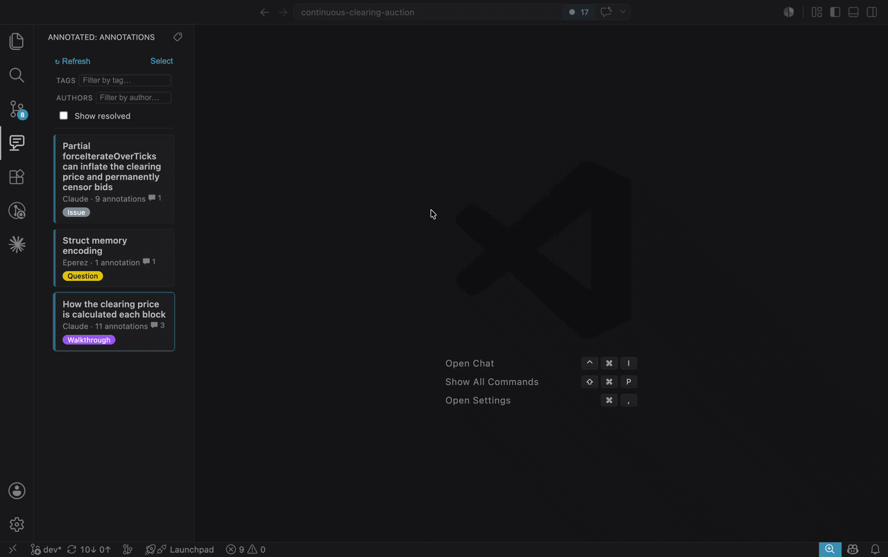

<div align="center">


# Annotated

Annotate a codebase with grouped, shareable Markdown annotations.

[](https://marketplace.visualstudio.com/items?itemName=eperezok.vscode-annotated)
[](https://github.com/EperezOk/vscode-annotated/actions/workflows/ci.yml)
[](LICENSE)

</div>

---

**Annotated** attaches grouped, Markdown annotations to ranges of code — for reviews, code tours,
onboarding notes, or just thinking out loud. Annotations live as plain JSON under `.annotations/`
in your repo, so they're diffable, shareable (commit them), and readable by AI agents. Organize
groups with tags, discuss them in comment threads, link a group to a Git ref, and resolve them
when the work is done.



## Quickstart

Open the **Annotated** view from the Activity Bar to browse, filter, and manage your annotation
groups. The everyday actions also have commands and keybindings:

| Command | Keybinding (mac · Win/Linux) | What it does |
| --- | --- | --- |
| `Annotated: Create Annotation` | `⌥⌘A` · `Ctrl+Alt+A` | Annotate the selected lines — pick an existing group or create one (title + tags). |
| `Annotated: Open Annotation at Cursor` | `⌥⌘O` · `Ctrl+Alt+O` | Open the annotation under the cursor in the detail view. |
| _Focus the Annotations sidebar_ | `⌥⌘L` · `Ctrl+Alt+L` | Reveal and focus the Annotations view. |
| `Annotated: Show / Hide Annotation Line Highlight` | `⌥⌘H` · `Ctrl+Alt+H` | Toggle the tint over annotated lines in the editor. |
| `Annotated: Manage Tags…` | — | Rename, recolor, or delete tags across your palette. |
| `Annotated: Copy Location for Annotation Link` | — | Right-click selected lines → copy a `path#L10-L20` link to paste into an annotation. |

A few things that live in the UI rather than as keybindings:

- **Detail view** (secondary sidebar): edit an annotation's Markdown, copy its content or
  `path:line` reference, jump prev/next, and reply in comment threads.
- **Local links**: an annotation's Markdown can link to code with `[label](src/foo.ts#L10-L20)`.
  Copy a target with **Copy Location for Annotation Link**, then paste it over selected text in the
  editor to wrap it as a link. Clicking a local link opens the file and highlights those lines
  (in a distinct colour) without leaving the annotation; **↩ Refocus code** jumps back to the
  annotation's own lines.
- **Bulk actions**: hit **Select** in the sidebar to tag, set a Git ref, resolve/restore, or
  delete multiple groups at once.
- **Delete**: right-click a group or an annotation.

## AI agent skill

`skills/annotated/` is a skill that lets an AI agent take part in an annotated workspace
— surf groups and comment threads, reply, create annotation groups/annotations, and
manage the tag palette — by reading and writing the `.annotations/` files
directly, under its own distinct identity (kept separate from yours).

Install it with a skill manager:

```bash
# GitHub CLI (gh ≥ 2.93)
gh skill install EperezOk/vscode-annotated annotated

# …or skills.sh
npx skills add EperezOk/vscode-annotated
```

Then ask your agent to, e.g., _"explain how X works with annotations"_ or _"answer the questions
I left in the annotations"_ — the groups it creates are navigable right alongside your own. See
[`skills/annotated/README.md`](skills/annotated/README.md) for the full operation set and rules.

## Development

Requires **Node ≥ 20.19**. This is a web-compatible extension — no Node built-ins in `src/`: pure
logic lives in `src/shared` + `src/core`, the thin VS Code layer in `src/web`, and the Svelte
webviews in `src/webview`.

```bash
npm install
npm run compile   # bundle extension + webviews (esbuild)
npm start         # launch in web VS Code (Chromium, via @vscode/test-web)

npm run test:unit         # Vitest: pure logic + Svelte components
npm run test:integration  # @vscode/test-web: extension-host activation/commands
npm run test:e2e          # Playwright: UI smoke against web VS Code
npm test                  # type-check + all tiers

npx @vscode/vsce package --no-dependencies   # build an installable .vsix
```
